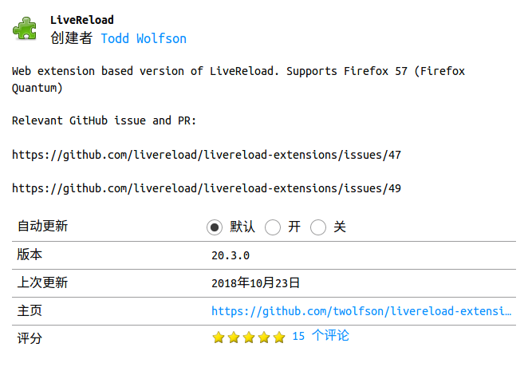

# **spring boot shiro 登录实现**
`spring boot` `shiro` `hibernate` `jpa` `ubuntu`

## **1. 常用工具框架的配置**

>### **devtools热部署工具**

- 依赖

```xml
<dependency>
  <groupId>org.springframework.boot</groupId>
  <artifactId>spring-boot-devtools</artifactId>
  <scope>runtime</scope>
</dependency>
```
```xml
<build>
<plugins>
  <plugin>
    <groupId>org.springframework.boot</groupId>
    <artifactId>spring-boot-maven-plugin</artifactId>
    <configuration>
      <!-- 如果没有该配置，devtools不会生效 -->
      <fork>true</fork>
    </configuration>
  </plugin>
</plugins>
</build>
```



