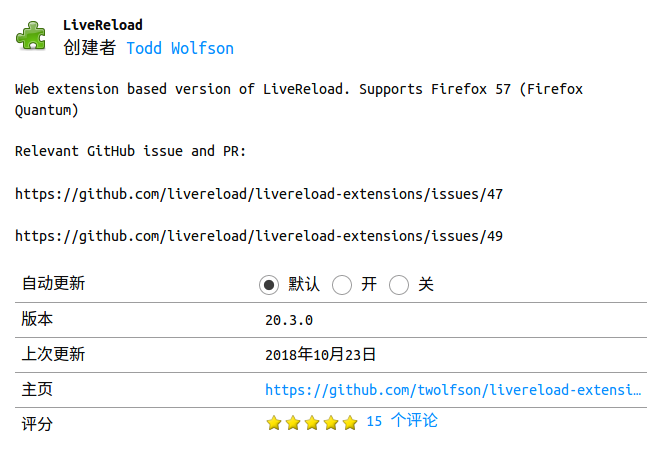

# **spring boot shiro 登录实现**
`spring boot` `shiro` `hibernate` `jpa` `ubuntu`

## **1. 常用工具框架的配置**

>### **devtools热部署工具**

- 依赖

```xml
<dependency>
  <groupId>org.springframework.boot</groupId>
  <artifactId>spring-boot-devtools</artifactId>
  <scope>runtime</scope>
</dependency>
```
```xml
<build>
<plugins>
  <plugin>
    <groupId>org.springframework.boot</groupId>
    <artifactId>spring-boot-maven-plugin</artifactId>
    <configuration>
      <!-- 如果没有该配置，devtools不会生效 -->
      <fork>true</fork>
    </configuration>
  </plugin>
</plugins>
</build>
```
ubuntu 下使用firefox的这个插件可以实现浏览器的自动刷新



- 配置
```yaml
spring:
  # devtools 配置
  devtools:
    livereload:
      enabled: true
      port: 35729
    restart:
      enabled: true
```

>### **swagger2 API框架**
- 依赖
```xml
<!-- https://mvnrepository.com/artifact/io.springfox/springfox-swagger2 -->
<dependency>
  <groupId>io.springfox</groupId>
  <artifactId>springfox-swagger2</artifactId>
  <version>2.9.2</version>
</dependency>
<dependency>
  <groupId>io.springfox</groupId>
  <artifactId>springfox-swagger-ui</artifactId>
  <version>2.6.1</version>
</dependency>
```
- 通过yml方式配置基本常量
```yaml
# swagger 常量
swagger:
  basePackage: com.qezhhnjy.login
  title: Sara项目使用Swagger2构建RestFul API
  description: 更多Spring Boot相关文章请关注：http://blog.didispace.com/
  service: http://blog.didispace.com/
  name: qezhhnjy
  url: www.fzyszsz.com
  email: fzyszsz@163.com
  version: 1.0
```
- 依赖注入配置
```java
@Configuration
@EnableSwagger2
@ConfigurationProperties(prefix = "swagger")
@Data
public class Swagger2Config {

    private String basePackage;
    private String title;
    private String description;
    private String service;
    private String name;
    private String url;
    private String email;
    private String version;

    @Bean
    public Docket createRestApi() {
        return new Docket(DocumentationType.SWAGGER_2)
                .apiInfo(apiInfo())
                .select()
                .apis(RequestHandlerSelectors.basePackage(basePackage))
                .paths(PathSelectors.any())
                .build();
    }

    private ApiInfo apiInfo() {
        return new ApiInfoBuilder()
                .title(title)
                .description(description)
                .termsOfServiceUrl(service)
                .contact(new Contact(name, url, email))
                .version(version)
                .build();
    }
}
```

- 使用方式

        @Api：修饰整个类，描述Controller的作用
        @ApiOperation：描述一个类的一个方法，或者说一个接口
        @ApiParam：单个参数描述
        @ApiModel：用对象来接收参数
        @ApiProperty：用对象接收参数时，描述对象的一个字段
        @ApiResponse：HTTP响应其中1个描述
        @ApiResponses：HTTP响应整体描述
        @ApiIgnore：使用该注解忽略这个API
        @ApiError ：发生错误返回的信息
        @ApiImplicitParam：一个请求参数
        @ApiImplicitParams：多个请求参数

[swagger2 注解说明](https://blog.csdn.net/xiaojin21cen/article/details/78654652)

>### **JPA - hibernate ORM框架的使用**

>### **thymeleaf 模板框架的使用**

>### **lombok插件的使用**

>### **jackson JSON序列化的使用**

>### 
